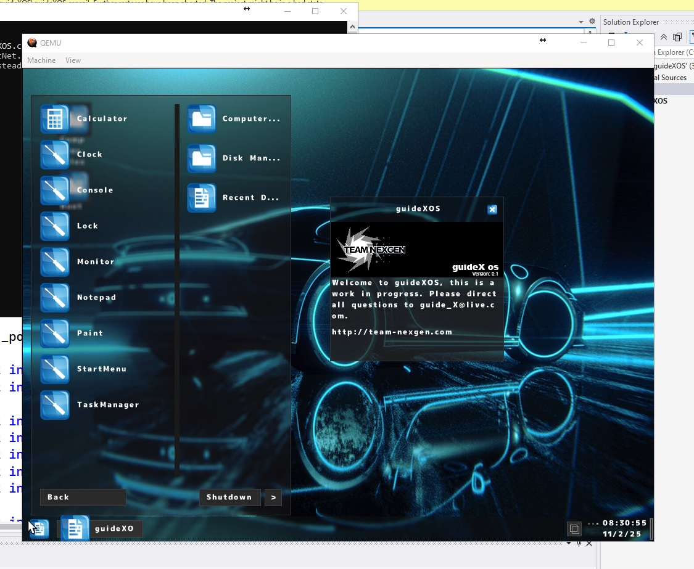
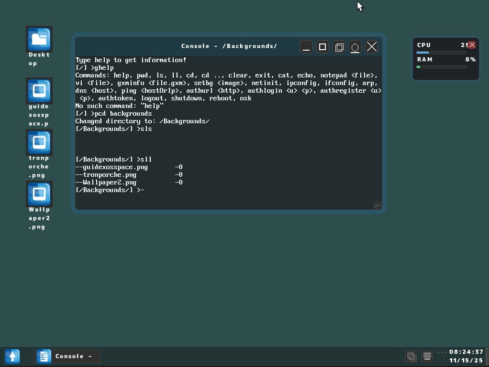
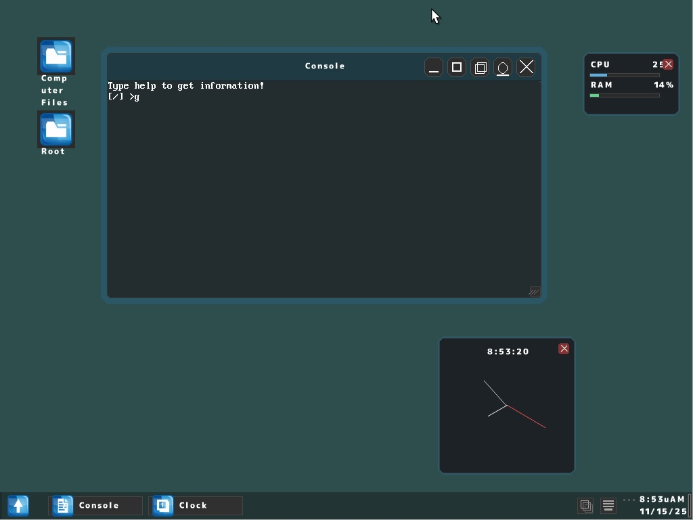
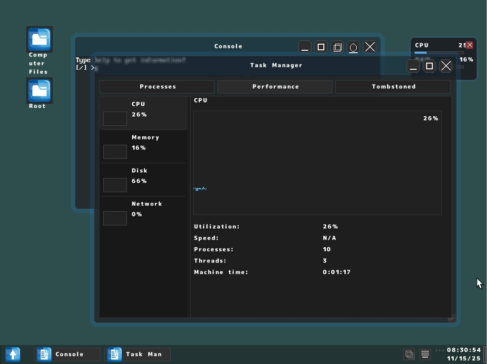
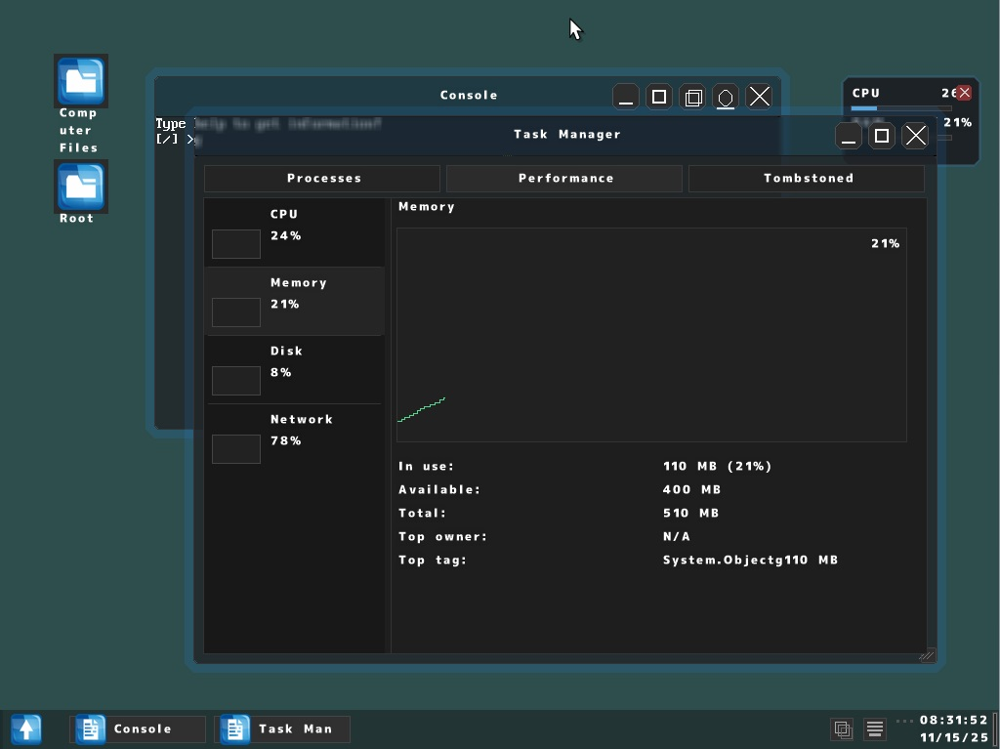
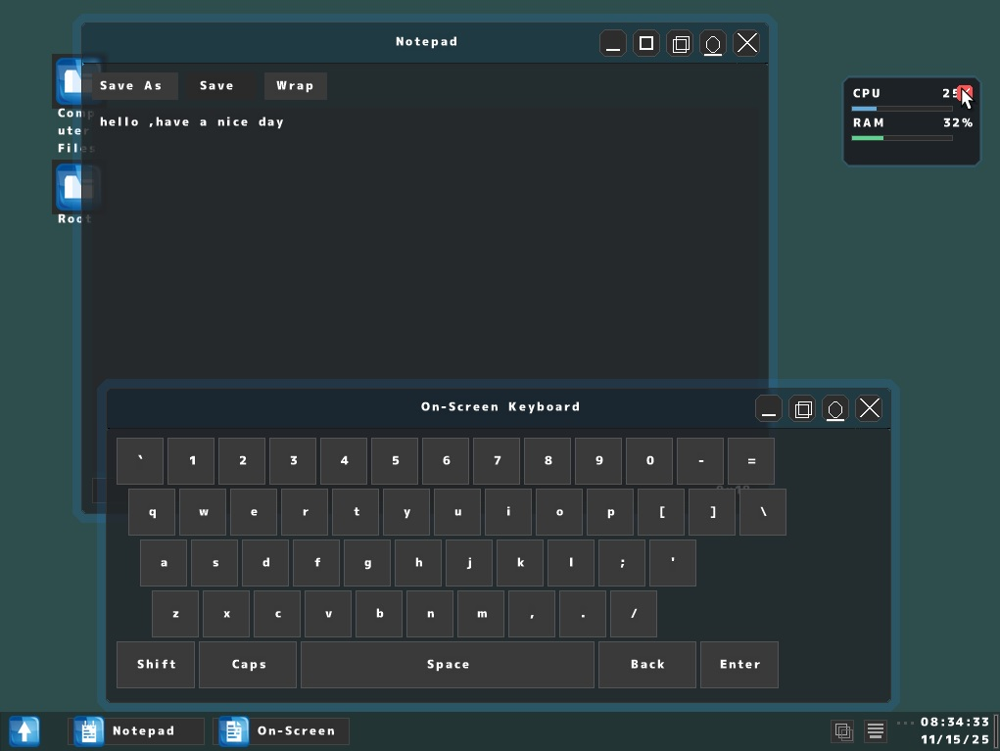
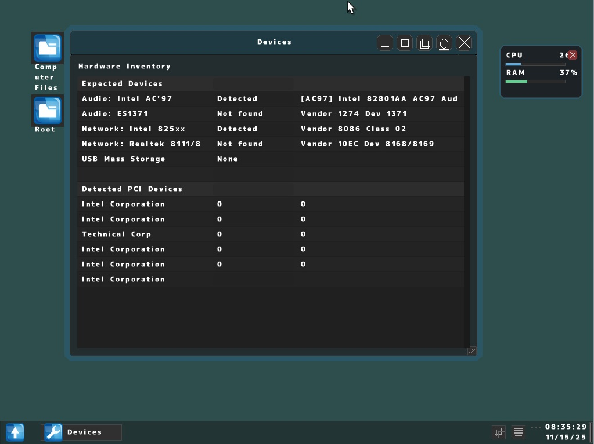
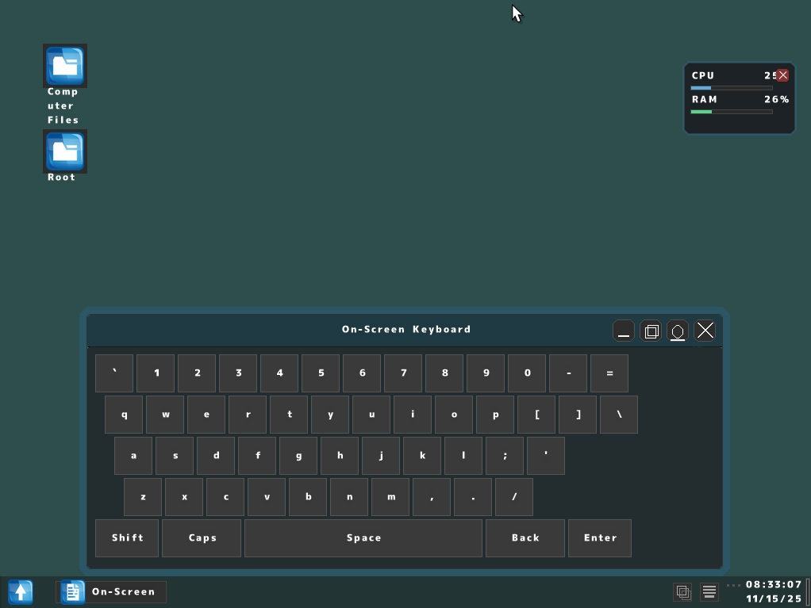

# guidexos
<h1>An operating system written entirely in C#</h1>

<h1>Features</h1>

<h3>Console</h3>

<h3>Clock</h3>

<h3>Task Manager Performance Tab/CPU</h3>

<h3>Task Manager Performance Tab/Memory</h3>

<h3>Notepad</h3>

<h3>Devices</h3>

<h3>On Screen Keyboard</h3>

